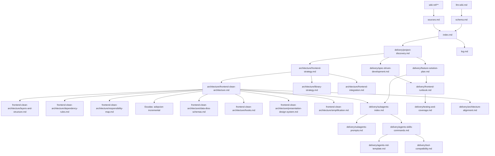

# Mapa

```text
wiki-frontend-only/
  README.md
  index.md
  map.md
  schema.md
  sources.md
  log.md
  architecture/
    frontend-strategy.md
    frontend-clean-architecture.md
    frontend-clean-architecture/
      layers-and-structure.md
      dependency-rules.md
      responsibility-map.md
      application-scales.md
      data-dtos-schemas.md
      use-cases.md
      hooks.md
      presentation-design-system.md
      simplification.md
    library-strategy.md
    frontend-integration.md
  delivery/
    project-discovery.md
    project-organization.md
    spec-driven-development.md
    feature-solution-plan.md
    subagents-index.md
    subagents-prompts.md
    agents-skills-commands.md
    agents-md-template.md
    frontend-runbook.md
    testing-and-coverage.md
    architecture-alignment.md
    tool-compatibility.md
```

## Ruta De Lectura

1. [Index](index.md)
2. [Schema](schema.md)
3. [Discovery Del Proyecto](delivery/project-discovery.md)
4. [Estrategia Frontend](architecture/frontend-strategy.md)
5. [Clean Architecture Frontend](architecture/frontend-clean-architecture.md)
6. [Spec Driven Development Con Spec Kit](delivery/spec-driven-development.md)
7. [Plan De Solucion De Features](delivery/feature-solution-plan.md)
8. [Indice De Subagentes Frontend](delivery/subagents-index.md)
9. [Prompts De Subagentes Frontend](delivery/subagents-prompts.md)
10. [Agentes, Skills Y Comandos](delivery/agents-skills-commands.md)
11. [Plantilla AGENTS.md](delivery/agents-md-template.md)
12. [Runbook Frontend Generico](delivery/frontend-runbook.md)
13. [Pruebas Y Coverage Frontend](delivery/testing-and-coverage.md)
14. [Alineacion De Arquitectura](delivery/architecture-alignment.md)
15. [Compatibilidad De Herramientas](delivery/tool-compatibility.md)

## Grafo Conceptual


